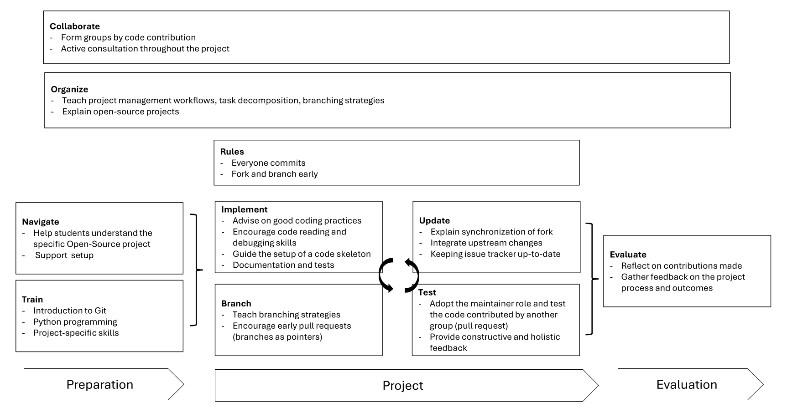

# Pedagogical concept

Aimed at achieving the [syllabus/learning objectives](syllabus.html#goal-and-learning-objectives)

Summarized in [syllabus/teaching approach](syllabus.html#teaching-approach)

## Educational Philosophy

TODO

## Implementation

{: .info }
> **TODO**: how/where to link these items in the teaching notes?

- Teaching strategies (introductory sessions - transfer-oriented/comlex exercise, regular sessions to ensure continuous progress)

- Contents structure and sequencing (see CONTRIBUTE principles)

- Assessment and feedback (formative, summative)

- Learning environments (physical/virtual, collaboration/communication between students)

- Motivation and engagement (building something that will be used/published)

- Evaluation and reflection (continuous improvement, student reflection)

## Supporting materials

Own publications

- GitCollaboration, TeaPad

    
Wagner, G., and Thurner, L. "Rethinking How We Teach Git: Recommendations and Practical Strategies for the Information Systems Curriculum". <i>Journal of Information Systems Education</i>, 36(1).

Additional literature

    
Hogbin Westby, E. J. (2015). Git for teams: a user-centered approach to creating efficient workflows in Git. O'Reilly Media.

    
Luciano, R. (2015). Fluent Python: Clear, Concise, and Effective Programming. O'Reilly Media.

