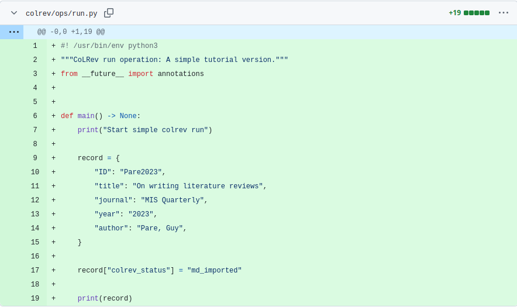
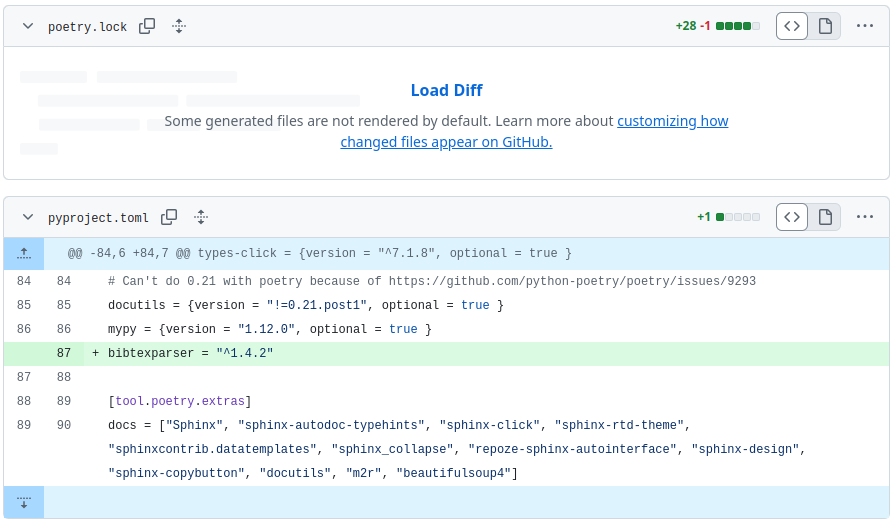
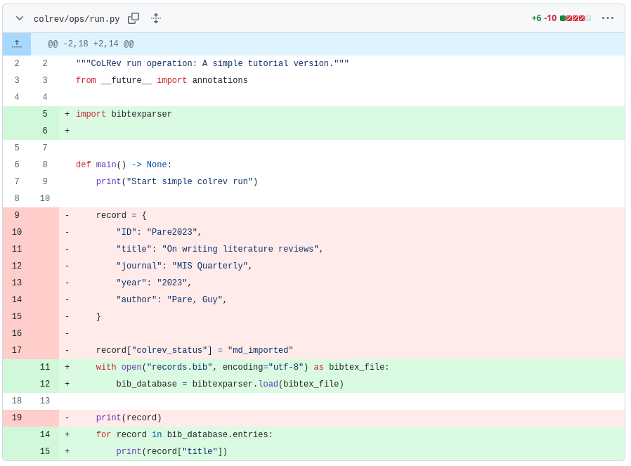
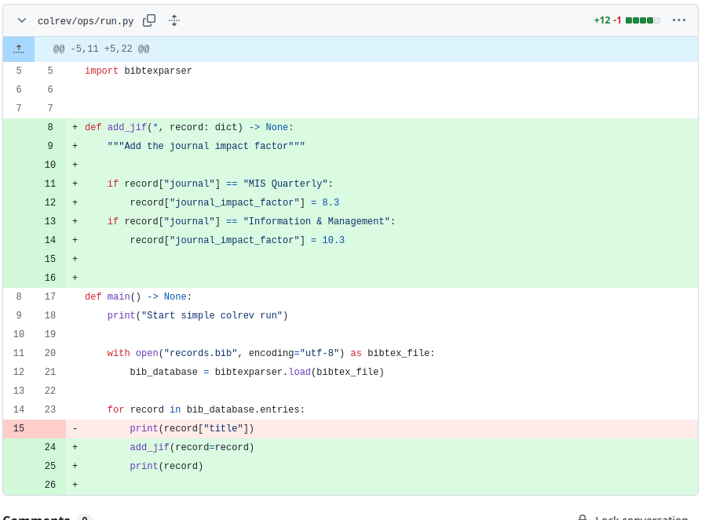

# Week 3: Python (Teaching notes)

| Time (start)   | Duration  | Topic                                | Additional materials                                                                                            |
|----------------|-----------|--------------------------------------|-----------------------------------------------------------------------------------------------------------------|
| 00:00          | 20        | Session 1: [Introduction](#intro)    | Concepts                                                                                                        |
| 00:20          | 80        | Session 1: [Notebook 1](#notebook_1) | [notebook 1](https://github.com/digital-work-lab/practice-python?tab=readme-ov-file){: target="_blank"})        |
| 01:40          | 10        | Session 1: [Wrap-up](#wrap-up)       |                                                                                                                 |
| 00:00          | 20        | Session 2: [Introduction](#intro_2)  | Concepts                                                                                                        |
| 00:20          | 80        | Session 2: [Notebook 2](#notebook_2) | [notebook 2](https://github.com/digital-work-lab/practice-python?tab=readme-ov-file){: target="_blank"})        |
| 01:40          | 10        | Session 2: [Wrap-up](#wrap-up_2)     |                                                                                                                 |

{: .objective }
> - Familiarize with Python syntax
> - Learn good debugging and development practices
> - Understand how to extend a Python package (CoLRev)

{: .info }
> Have students start the codespaces on Github from colrev/tutorial branch (see notebook)

<div class="page-break"></div>

# Preparation

```
git checkout tutorial_python
git rebase -i HEAD~16
# edit the "update click" commit (before the tutorial starts) with the latest pyproject.toml / poetry update to update poetry.lock
git rebase main
git push -f
```

- [ ] Update git-commit SHAs in the notebooks
- [ ] Checkout tutorial2 branch (tutorial branch should be available as a backup)
- [ ] Test the tutorial in Codespaces

<!-- 
- before switching to tutorial/after the tutorial:
run pip3 install -e . (to take code from the right repository)
 -->

- [ ] Print the teaching notes, including code diffs (python-tutorial-notes.odt) for the commits on paper (to facilitate life-coding)

# Short group sessions

- who forked/leads
- clear announcement for overbooked groups

highlight:

- Use google/Stackoverflow on any error/challenge that comes up!
- Using Code quality checkers and tests

Discuss take-home exercise (collaborating)?

<div class="page-break"></div>

# Python

Object-oriented
Procedural
Functional

Interpreted language: unlike Java which requires us to compile the jar file 


- Strongly typed: Explicit conversion required
- Python fails at runtime when asked to multiply/divide strings and strings. If you need the numbers stored inside a string variable, you need to cast it explicitly (`int_var = int("99")`).
- dynamically typed: typing information is only evaluated when running code (e.g., string * string in if-statement that is not evaluated does not fail)

Example:

```
Java: 
int count = 2;

Python:
count = 2
# type(count) = class:int (everything is an object)
word = "test"
count*word = "testtest"
word+count # raises TypeError (searches for addition-operation for two strings and fails)
word+str(count) + "test2"
# think: count = "2"
if False:
  cound+word # not error - never executed (dynamically typed, i.e., only evaluated at runtime)
if True:
  cound+word # error
```

<!-- https://www.futurelearn.com/info/courses/python-in-hpc/0/steps/65121#:~:text=Python%20is%20both%20a%20strongly,is%20determined%20only%20during%20runtime. -->


Our focus: using the programming language to build things (not to understand the programming language)

# Important

Students should not set up their machines during the session.
Ask students to complete the tutorial on github codespaces

setup for the data directory:
```
shell:
cd ..
mkdir data
Datei: Ordner zum Arbeitsbereich hinzufügen (select workspace/data)
open two separate shells
```

# Entrypoint

- Explain `__main__`

- commit: pre-commit hooks!
- explain later (they do some formatting and warn us if there are code quality issues)

Goal: orientation/read code, try to figure out things

# Creating dictionaries

Optional additional challenge: use the constants as keys (package development docs)



<div class="page-break"></div>

# External libraries

after 2-3 minutes: write BibtexParser on the blackboard

{: .warning }
> **Important: bibtexparser version has changed**
> 
> Students need to use the old entrypoint (available in the docs menu "Migrating: v1 -> v2").


```
# v1
import bibtexparser
with open('bibtex.bib') as bibtex_file:
    bib_database = bibtexparser.load(bibtex_file)
```





<!--
Note: our version (on tutorial_branch) only works with v1.
At some point, we may migrate to v2
> Or install the new version using
> 
> pip install --no-cache-dir --force-reinstall git+https://github.com/sciunto-org/python-bibtexparser@main
 -->

# JIF labeler:

Remember:

- Call-by-value: for "simple data types" (str, int, float)
- Call-by-reference: for mutable objects (list, dict, object)

```
# Starting point: add_journal_impact_factor(record: dict) changes the values of the dictionary outside the function (without an explicit return/assignment)

def change_journal(journal: str) -> None:
  journal = "Nature"

journal = "MIS Quarterly"
change_journal(journal)
print(journal) # prints MIS Quarterly (not nature) due to call-by-value for simple/immutable data types in Python
```

Show input() when iterating over the results

Google
- "mypy no-untyped-def"
- "mypy no-untyped-def"
- "pylint missing-function-docstring"

Explain difference between positional and keyword arguments

Note: it can be helpful to make mistakes on purpose (e.g., indentation, etc.) to read and interpret the error messages with students.

Pylint example.

```
example:
************* Module colrev.ops.built_in.search_sources.aisel
colrev/ops/built_in/search_sources/aisel.py:225:19: W3101: Missing timeout argument for method 'requests.get' can cause your program to hang indefinitely (missing-timeout)
```



# Best practices

small examples: clarify the "big goal" and start with small steps
linters: already installed

Code highlighting (visual studio): functions yellow, variables light blue, instances blue, classes green, strings orange
python debuggers/plugins (for regular Python programming / special cases like memory usage or distributed systems)

<div class="page-break"></div>

# Python session 2 (end)

run the pre-commit hooks a few times to illustrate the typing information

## Object-oriented programming

Important: try to program using objects (instead of procedural programming)

if record["journal"] == "MIS Quarterly":
KeyError: 'journal'
-> if statement (better: if "journal" not in record: return)

Notice: when creating the run() method, the jif_labeler_instance switches to "self".


## Using CoLRev infrastructure

go to API reference
navigate through the classes / dataset


TBD:
  - search: run an api-search example, examine the commit message (settings changed! -> reference implementation)
-> we add a query -> docs: interface definitions: searchsource.add_endpoint(), run_search()
  -> see interfaces (standardized function parameters/names)
  - where to find the built_in reference implementation (docs/architecture and directories), how to add/remove in the settings
  -> see package_endpoint definitions (package_manager, docs)

  continue: prep/validation

  continue to data: show advice?


# Next: Best practice and hacking sessions (per group)

Pair-programming

which CoLRev-objects or libraries will be needed, which steps are required

- Create a fork for the team, give access to team members, and add a note to the issue feed
- All team members: clone the fork (using `git clone git@github.com:CoLRev-Environment/colrev.git`)
- Check the resources provided with the issue, discuss the project, and make plans

## Resources

- [Python programming for data science](https://www.tomasbeuzen.com/python-programming-for-data-science/README.html){: target="_blank"} with Python basics (and **unit tests**)
- [Welcome to Python Packages](https://py-pkgs.org/){: target="_blank"}
