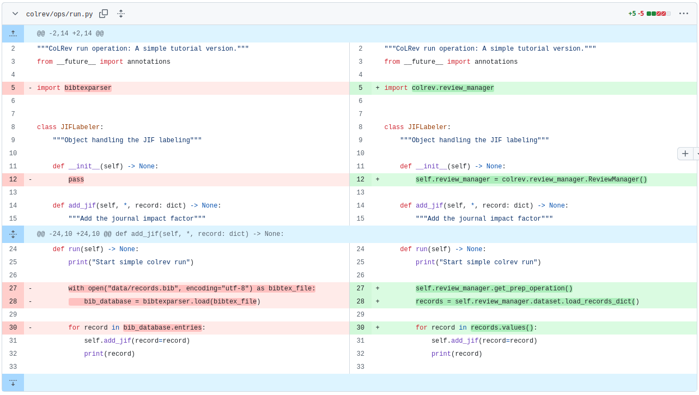
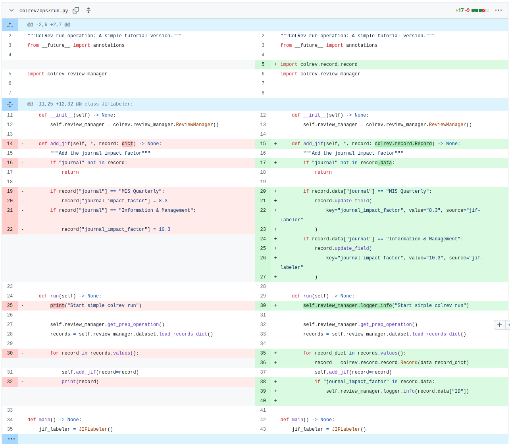
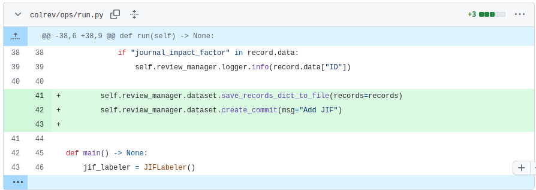

# Week 3: Python 2 (Teaching notes)

| Time (start) | Duration | Topic                                           | Additional materials                                              |
|--------------|----------|-------------------------------------------------|-------------------------------------------------------------------|
| 00:00        | 10       | Set up the example repository                   |                                                                   |
| 00:10        | 60       | Part 4: [Object-oriented code](#object)         | [notebook 2](week_3_python_notebook_2.html){: target="_blank"}    |
| 01:10        | 30       | Part 5: [Programmatic use of CoLRev](#colrev)   |                                                                   |
| 01:40        | 10       | Part 6: [Save and commit changes](#save-commit) |                                                                   |
| 01:50        | 10       | [Wrap-up](#wrap-up)                             |                                                                   |
| 02:00        | 110      | Overall                                         |                                                                   |

{: .info }
> - Have students start the codespaces on Github from colrev/tutorial branch (see notebook)
> - Ask students how they interpret the error messages, articulate the problem, how they would solve the problem, where/how they would search (do not provide solutions)
> - Run the pre-commit hooks a few times to illustrate the typing information

## Object-oriented programming 

- Encourage students to program using objects (instead of procedurally)
- Notice: when creating the `run()` method, the jif_labeler_instance switches to "self".

## Using CoLRev infrastructure 

- Go to API reference
- Navigate through the classes / dataset

## Save and commit  

- Ask students to analyze the changes that were actually committed
- Remind students that this is something they should have seen in the CoLRev tutorial.

## Merging Exercise (moved to a later time point)

**Until the 10th of November**

- explain to the students what the merging exercise is about 
- tell them about the survey and that it is important to fill it out for the best practice session
- maybe create even a slide for students to look it up again

## Wrap-up 

**Deliverable: Merge**

- Merge should be done in one of the first hacking session meetings
- Students should prepare the merge by selecting suitable branches and explaining why they should be merged
- We will complete the merge together with the students to prevent and solve problems

**Next: Best practice and hacking sessions (per group)**

- Suggest pair-programming
- Which CoLRev-objects or libraries will be needed, and which steps are required
- Create a fork for the team, give access to team members, and add a note to the issue feed
- Check the resources provided with the issue, discuss the project, and make plans

## Resources 

- [Python programming for data science](https://www.tomasbeuzen.com/python-programming-for-data-science/README.html){: target="_blank"} with Python basics (and **unit tests**)
- [Welcome to Python Packages](https://py-pkgs.org/){: target="_blank"}
