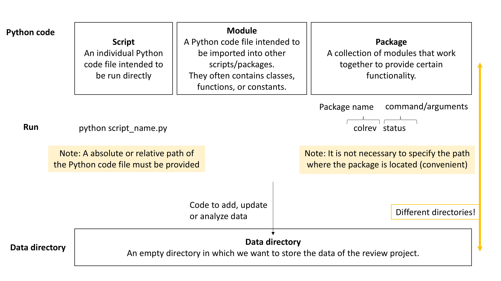
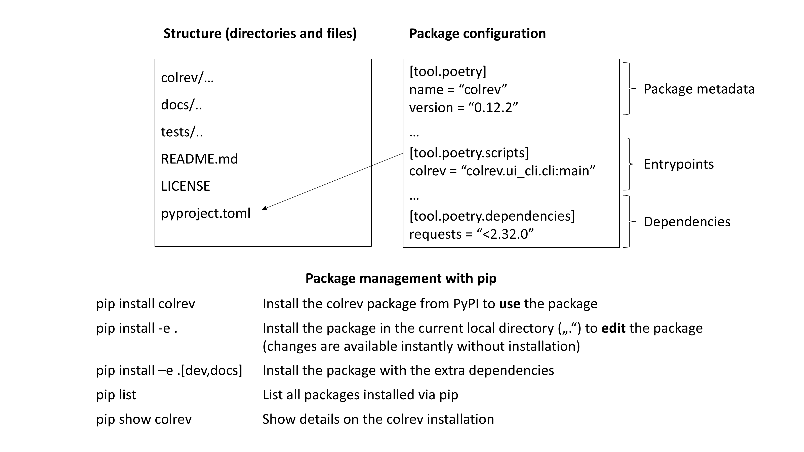

<!-- paginate: true -->

<!-- _class: centered -->

## Project: Introduction to Python (1)

## Topics

Prof. Dr. Gerit Wagner
Fakultät Wirtschaftsinformatik und Angewandte Informatik
Otto-Friedrich-Universität Bamberg


---

# Project: Groups, forks and setup

- Groups formed in the issue feeds
- Forks were created.
- Further questions related to GitHub or the setup?

---

# Learning objectives:

- Familiarize with Python syntax
- Learn good debugging and development practices
- Understand how to extend a Python package (CoLRev)

# Groups

- Form groups of three to four, solve the tasks together, and discuss your solutions.

---

# Start the Codespace

Open the[ notebook for practicing Python](https://digital-work-lab.github.io/open-source-project/docs/week_3_python_notebook_1.html).

Start the Codespace in the `tutorial_python` branch of the CoLRev upstream repository.

<!-- [](https://github.com/codespaces/new?repo=digital-work-lab/practice-python) -->

The setup can run in the background, while we focus on the concepts.

---

# Python

- Supports multiple paradigms: object-oriented, procedural, or functional
- Python is an interpreted language: no need to compile (build jars) before running
- Uses indentation instead of brackets to separate blocks (such as if statements)
- Is strongly, dynamically typed
- Provides access to many packages on [PyPI](https://pypi.org/), covering machine learning, data science, web scraping, etc.
- Python is actively developed, with new versions introducing changes in functionality and old versions no longer receiving security updates
  - Python 3.6 (2016): [Introduction of f-strings](https://www.geeksforgeeks.org/formatted-string-literals-f-strings-python/)
  - Python 3.7 (2018): [Dictionaries are now ordered](https://www.geeksforgeeks.org/are-python-dictionaries-ordered/)
  - ...

---

# What we will learn in the Python session(s)


---

# Writing and running Python code




---

# Python packages



<!-- 
---

For the tutorial, we switch to the `tutorial_2024_04` branch:

```
git clone https://github.com/CoLRev-Environment/colrev
cd colrev
pip install -e .[dev]
git fetch
git checkout tutorial_2024_04
git reset --hard ca9902e666518af1d33a368adf055c9809004433
```

- As the session progresses, you can checkout the current commits.
- Whenever you see a `git reset --hard ...` command on the following slides, you can use it to set your repository to the required state (commit).
-->

---

# Best practices

- Carefully read tutorials, vignettes, and code examples (e.g., on GitHub) 
- Start with small code segments, try whether they work, and extend them
- Add or commit working code frequently
- Use code linters to ensure high code quality (run `pre-commit run --all`)
- To debug code, check whether variables have the expected values (use assert or print statements)
- When exceptions are thrown, read the Traceback:


---

# Next steps

- Read the [package development](https://colrev-environment.github.io/colrev/dev_docs/packages.html) documentation.
- Study code of related CoLRev packages.
- Take notes on the CoLRev-objects or libraries that will be needed.

Note: These [tutorials](https://www.codecademy.com/catalog/language/python?g_network=g&g_productchannel=&g_adid=624888211335&g_locinterest=&g_keyword=codecademy%27s%20learn%20python&g_acctid=243-039-7011&g_adtype=&g_keywordid=kwd-2259230975260&g_ifcreative=&g_campaign=account&g_locphysical=9042755&g_adgroupid=128133971748&g_productid=&g_source={sourceid}&g_merchantid=&g_placement=&g_partition=&g_campaignid=12575778360&g_ifproduct=&utm_id=t_kwd-2259230975260:ag_128133971748:cp_12575778360:n_g:d_c&utm_source=google&utm_medium=paid-search&utm_term=codecademy%27s%20learn%20python&utm_campaign=INTL_Brand_Phrase&utm_content=624888211335&g_adtype=search&g_acctid=243-039-7011&gad_source=1&gclid=CjwKCAjwzIK1BhAuEiwAHQmU3t-FhdTeqJcFCUfaU1x1cvYdKGfh9vdxz1b8ll5Tl_2wcSc8wgMNhRoCJqoQAvD_BwE) may be helpful to continue practicing Python

---

# We value your feedback and suggestions

We encourage you to share your feedback and suggestions on this slide deck:

<a href="https://github.com/digital-work-lab/open-source-project/edit/main/slides/03-python_1.md" target="_blank">
   Suggest specific changes by directly modifying the content
</a>
<br>
<a href="https://github.com/digital-work-lab/open-source-project/issues/new" target="_blank">
   Provide feedback by submitting an issue
</a>
<br>

Your feedback plays a crucial role in helping us align with our core goals of **impact in research, teaching, and practice**. By contributing your suggestions, you help us further our commitment to **rigor**, **openness** and **participation**. Together, we can continuously enhance our work by contributing to **continuous learning** and collaboration across our community.

Visit this <a href="https://digital-work-lab.github.io/handbook/docs/10-lab/10_processes/10.01.goals.html" target="_blank">page</a> to learn more about our goals:  🚀 🛠️ ♻️ 🙏 🧑‍🎓️ . 
